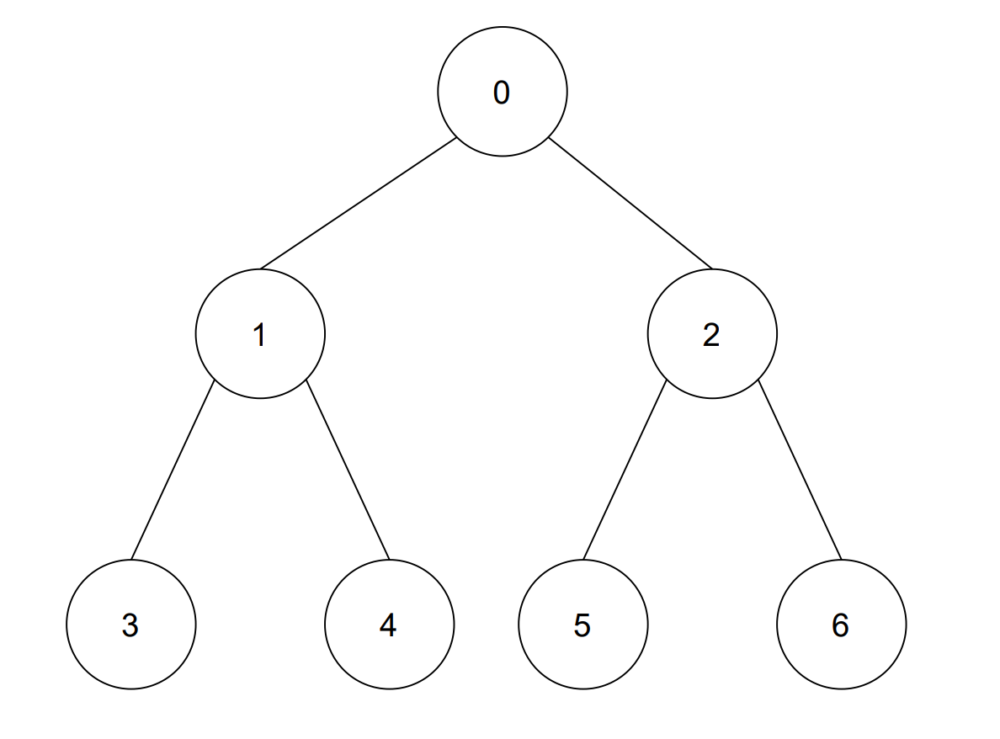

# Algorithm

## Contents
1. [DFS](#DFS)
2. [BFS](#BFS)

## DFS

### 1. Adjacency Matrix
#### 1. Recursive
```java
public class Dfs {

    public static void main(String[] args) {
        int[][] adjacencyMatrix = {{1, 1, 1, 0, 0, 0, 0},
                {1, 1, 0, 1, 1, 0, 0},
                {1, 0, 1, 0, 0, 1, 1},
                {0, 1, 0, 1, 0, 0, 0},
                {0, 1, 0, 0, 1, 0, 0},
                {0, 0, 1, 0, 0, 1, 0},
                {0, 0, 1, 0, 0, 0, 1}};

        boolean[] visited = new boolean[adjacencyMatrix.length];
        dfs(0, adjacencyMatrix, visited);

        visited = new boolean[adjacencyMatrix.length];
        dfs(3, adjacencyMatrix, visited);
    }

    private static void dfs(int node, int[][] adjacencyMatrix, boolean[] visited) {
        visited[node] = true;
        if (isAllTrue(visited)) System.out.println(node);
        else System.out.print(node + "->");

        for (int i = 0; i < adjacencyMatrix[node].length; i++) {
            if (!visited[i] && adjacencyMatrix[node][i] == 1) {
                dfs(i, adjacencyMatrix, visited);
            }
        }
    }

    private static boolean isAllTrue(boolean[] arr) {
        for (int i = 0; i < arr.length; i++) {
            if (!arr[i]) return false;
        }
        return true;
    }
}
```
```text
0->1->3->4->2->5->6
3->1->0->2->5->6->4
```
## BFS

### 1. Adjacency Matrix
#### 1. Queue
```java
import java.util.LinkedList;
import java.util.Queue;

public class Bfs {

    public static void main(String[] args) {
        int[][] adjacencyMatrix = {{1, 1, 1, 0, 0, 0, 0},
                {1, 1, 0, 1, 1, 0, 0},
                {1, 0, 1, 0, 0, 1, 1},
                {0, 1, 0, 1, 0, 0, 0},
                {0, 1, 0, 0, 1, 0, 0},
                {0, 0, 1, 0, 0, 1, 0},
                {0, 0, 1, 0, 0, 0, 1}};

        bfs(0, adjacencyMatrix);

        bfs(3, adjacencyMatrix);
    }

    private static void bfs(int root, int[][] adjacencyMatrix) {
        boolean[] visited = new boolean[adjacencyMatrix.length];

        Queue<Integer> queue = new LinkedList<>();
        queue.offer(root);

        while (!queue.isEmpty()) {
            var number = queue.poll();
            visited[number] = true;
            for (int i = 0; i < adjacencyMatrix[number].length; i++) {
                if (!visited[i] && adjacencyMatrix[number][i] == 1) queue.offer(i);
            }
            if (queue.isEmpty()) System.out.println(number);
            else System.out.print(number + "->");
        }
    }
}
```
```text
0->1->2->3->4->5->6
3->1->0->4->2->5->6
```
