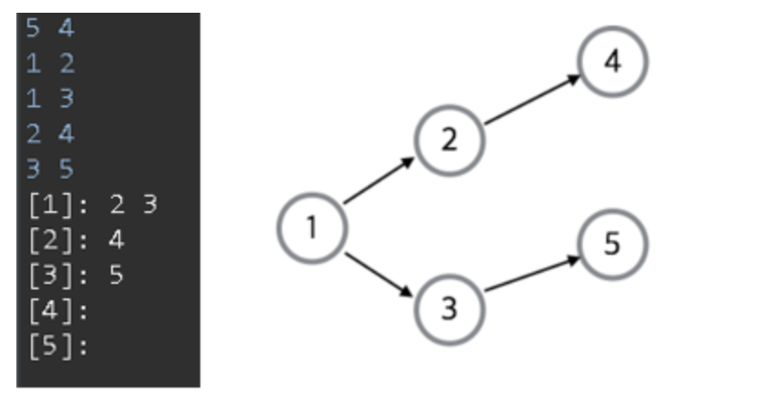
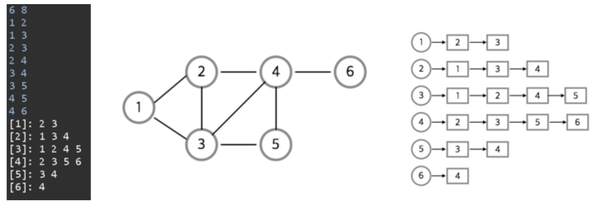

# Graph
## Directed Graph

### 1. List
```java
public static void main(String[] args) {
    var sc  = new Scanner(System.in);

    var vCnt = Integer.parseInt(sc.next());
    var eCnt = Integer.parseInt(sc.next());

    ArrayList<ArrayList<Integer>> list = new ArrayList<>();

    list.add(new ArrayList<Integer>());
    for (int i = 0; i < vCnt; i++) {
        list.add(new ArrayList<Integer>());
    }

    for (int i = 0; i < eCnt; i++) {
        var startVertex = sc.nextInt();
        var endVertex = sc.nextInt();
        list.get(startVertex).add(endVertex);
    }

    for (ArrayList<Integer> integers : list) {
        for (Integer integer : integers) {
            System.out.print(integer + " ");
        }
        System.out.println();
    }
}
```
### 2. Adjacency Matrix
```java
public static void main(String[] args) {
    var sc  = new Scanner(System.in);

    var vCnt = sc.nextInt();
    var eCnt = sc.nextInt();

    int[][] matrix = new int[vCnt + 1][vCnt + 1];

    for (int i = 0; i < eCnt; i++) {
        var startVertex = sc.nextInt();
        var endVertex = sc.nextInt();
        matrix[startVertex][endVertex] = 1;
    }

    for (int i = 1; i <= vCnt; i++) {
        System.out.print("[" + i + "]: ");
        for (int j = 1; j <= vCnt; j++) {
            System.out.print(matrix[i][j] + " ");
        }
        System.out.println();
    }
}
```

## Undirected Graph


### 1. List
```java
public static void main(String[] args) {
    var sc  = new Scanner(System.in);

    var vCnt = Integer.parseInt(sc.next());
    var eCnt = Integer.parseInt(sc.next());

    ArrayList<ArrayList<Integer>> list = new ArrayList<>();

    list.add(new ArrayList<Integer>());
    for (int i = 0; i < vCnt; i++) {
        list.add(new ArrayList<Integer>());
    }

    for (int i = 0; i < eCnt; i++) {
        var startVertex = sc.nextInt();
        var endVertex = sc.nextInt();
        list.get(startVertex).add(endVertex);
        list.get(endVertex).add(startVertex);
    }

    for (ArrayList<Integer> integers : list) {
        System.out.print("[" + list.indexOf(integers) + "]: ");
        for (Integer integer : integers) {
            System.out.print(integer + " ");
        }
        System.out.println();
    }
}
```
### 2. Adjacency Matrix
```java

```